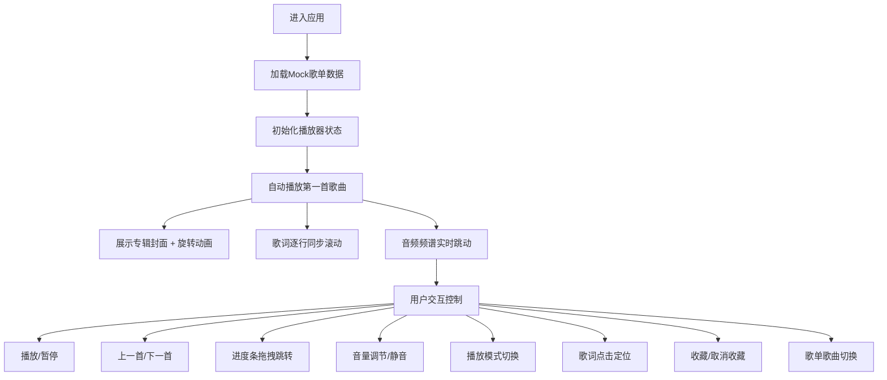

## 1. 产品概述
对标网易云音乐、Spotify等主流音乐网页端，打造一款视觉精美、交互流畅的在线Web音乐播放器。纯前端实现，可独立部署，支持完整的音乐播放控制、歌词同步、音频可视化和歌单管理功能，为用户提供沉浸式音乐体验。

## 2. 核心功能

### 2.1 用户角色
| 角色 | 注册方式 | 核心权限 |
|------|----------|----------|
| 普通用户 | 无需注册，纯前端本地存储 | 使用所有播放功能、管理个人收藏和歌单 |

### 2.2 功能模块
1. **播放器主界面**：专辑封面展示、音频可视化频谱、播放控制栏
2. **播放控制模块**：播放/暂停、上一首/下一首、进度条拖拽、音量调节、静音切换
3. **播放模式模块**：列表循环、单曲循环、随机播放三种模式切换
4. **歌词展示模块**：逐行同步滚动、当前歌词高亮、支持拖拽定位
5. **歌单管理模块**：歌单列表展示、歌曲切换、收藏管理
6. **个人收藏模块**：收藏/取消收藏歌曲、收藏列表持久化存储

### 2.3 页面详情
| 页面名称 | 模块名称 | 功能描述 |
|----------|----------|----------|
| 主页面 | 可视化频谱区 | 动态音频频谱动画，随音乐节奏实时跳动 |
| 主页面 | 专辑封面区 | 展示当前播放歌曲专辑封面，带旋转动画 |
| 主页面 | 歌词展示区 | 歌词同步滚动，高亮当前行，支持点击跳转 |
| 主页面 | 播放控制栏 | 播放/暂停、上下首切换、进度条、音量、播放模式 |
| 主页面 | 歌单侧边栏 | 歌单列表、歌曲信息、收藏按钮、当前播放指示 |
| 主页面 | 收藏管理区 | 展示已收藏歌曲，支持快速播放和取消收藏 |

## 3. 核心流程

用户进入应用 → 加载默认歌单 → 自动播放第一首歌曲 → 展示同步歌词和动态频谱 → 用户可进行播放控制/切换歌曲/调整音量/切换播放模式 → 点击歌词跳转播放进度 → 收藏喜欢的歌曲 → 切换到收藏列表播放

## 4. 用户界面设计

### 4.1 设计风格
- **设计理念**：深色玻璃态（Glassmorphism）+ 霓虹渐变，营造沉浸式音乐氛围
- **主色调**：深靛蓝渐变（#1a1a2e → #16213e）作为背景，霓虹粉（#ff2a6d）和电光青（#05d9e8）作为双强调色
- **按钮风格**：圆角胶囊形，带玻璃态半透明效果，悬停时有发光动画
- **字体**：标题使用 'Orbitron' 未来感字体，正文使用 'Noto Sans SC' 清晰易读
- **布局风格**：三栏布局（左侧歌单 + 中间播放区 + 右侧歌词），底部固定播放控制栏
- **图标风格**：Lucide React 线性图标，配合霓虹发光效果

### 4.2 页面设计概述
| 页面名称 | 模块名称 | UI元素 |
|----------|----------|--------|
| 主页面 | 可视化频谱区 | 64根渐变频谱柱，霓虹发光效果，随音乐节奏高低变化 |
| 主页面 | 专辑封面区 | 圆形唱片样式，播放时缓慢旋转，暂停时停止，带霓虹光晕 |
| 主页面 | 歌词展示区 | 毛玻璃背景，当前歌词放大高亮带渐变色彩，上下歌词半透明 |
| 主页面 | 播放控制栏 | 半透明磨砂玻璃效果，进度条带渐变色彩，按钮悬停发光 |
| 主页面 | 歌单侧边栏 | 深色半透明背景，歌曲条目悬停高亮，当前播放歌曲带霓虹指示条 |
| 主页面 | 收藏管理区 | 心形图标按钮，已收藏显示填充霓虹粉色，支持快速切换 |

### 4.3 响应式设计
- **桌面端优先**：三栏完整布局，1280px以上最佳展示
- **平板适配**：1024px以下合并为两栏，歌单可折叠
- **移动端适配**：768px以下单栏布局，歌单改为底部抽屉式，歌词和频谱区域自适应堆叠
- **触摸优化**：按钮最小尺寸44px，滑动手势支持进度调节和歌曲切换

### 4.4 动画与交互细节
- **页面加载**：元素按顺序淡入，频谱从底部升起
- **播放状态**：专辑封面33秒一圈匀速旋转，暂停时带缓动停止
- **频谱动画**：使用requestAnimationFrame实现60fps流畅动画，频谱柱高度变化带弹性过渡
- **歌词滚动**：当前行切换时带平滑滚动动画，高亮渐变过渡
- **按钮交互**：悬停时缩放1.05倍+发光，点击时缩放0.95倍带涟漪效果
- **进度条**：拖拽时实时更新预览位置，释放时跳转播放
