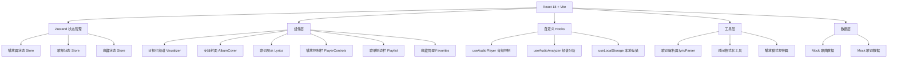

## 1. 架构设计



## 2. 技术选型说明

- **前端框架**：React@18 + TypeScript + Vite@5
- **状态管理**：Zustand@4（轻量级、高性能状态管理）
- **样式方案**：TailwindCSS@3 + CSS 变量（主题系统）
- **路由**：react-router-dom@6（单页应用路由）
- **图标库**：lucide-react@0.344（线性图标，配合霓虹发光效果）
- **音频处理**：Web Audio API（原生API实现频谱分析）
- **数据持久化**：localStorage（收藏列表本地存储）
- **后端**：无，纯前端实现，所有数据使用Mock数据

## 3. 目录结构

```
src/
├── components/          # 组件目录
│   ├── player/         # 播放器相关组件
│   │   ├── PlayerControls.tsx    # 播放控制栏
│   │   ├── ProgressBar.tsx       # 进度条组件
│   │   ├── VolumeControl.tsx     # 音量控制组件
│   │   └── PlayModeToggle.tsx    # 播放模式切换
│   ├── visualizer/     # 可视化组件
│   │   └── AudioSpectrum.tsx     # 音频频谱组件
│   ├── lyrics/         # 歌词组件
│   │   └── LyricsDisplay.tsx     # 歌词展示组件
│   ├── playlist/       # 歌单组件
│   │   ├── PlaylistSidebar.tsx   # 歌单侧边栏
│   │   ├── SongItem.tsx          # 歌曲条目组件
│   │   └── FavoritesList.tsx     # 收藏列表组件
│   └── common/         # 通用组件
│       └── AlbumCover.tsx        # 专辑封面组件
├── hooks/              # 自定义 Hooks
│   ├── useAudioPlayer.ts         # 音频播放器 Hook
│   ├── useAudioAnalyzer.ts       # 音频频谱分析 Hook
│   └── useLocalStorage.ts        # 本地存储 Hook
├── store/              # Zustand Store
│   ├── usePlayerStore.ts         # 播放器状态
│   ├── usePlaylistStore.ts       # 歌单状态
│   └── useFavoritesStore.ts      # 收藏状态
├── utils/              # 工具函数
│   ├── lyricParser.ts            # 歌词解析器
│   ├── formatTime.ts             # 时间格式化
│   └── playMode.ts               # 播放模式控制
├── data/               # Mock 数据
│   ├── songs.ts                  # 歌曲数据
│   └── lyrics.ts                 # 歌词数据
├── types/              # TypeScript 类型定义
│   └── index.ts                  # 类型定义文件
├── pages/              # 页面组件
│   └── Home.tsx                  # 主页
├── App.tsx             # 根组件
├── main.tsx            # 入口文件
└── index.css           # 全局样式 + Tailwind
```

## 4. 核心状态模型 (Zustand Store)

### 4.1 播放器状态
```typescript
interface PlayerState {
  currentSong: Song | null;
  isPlaying: boolean;
  currentTime: number;
  duration: number;
  volume: number;
  isMuted: boolean;
  playMode: 'loop' | 'single' | 'shuffle';
  playList: Song[];
  currentIndex: number;
  // Actions
  play: () => void;
  pause: () => void;
  togglePlay: () => void;
  next: () => void;
  prev: () => void;
  seek: (time: number) => void;
  setVolume: (volume: number) => void;
  toggleMute: () => void;
  setPlayMode: (mode: 'loop' | 'single' | 'shuffle') => void;
  playSong: (song: Song, index?: number) => void;
}
```

### 4.2 歌单状态
```typescript
interface PlaylistState {
  songs: Song[];
  currentView: 'all' | 'favorites';
  // Actions
  setCurrentView: (view: 'all' | 'favorites') => void;
}
```

### 4.3 收藏状态
```typescript
interface FavoritesState {
  favoriteIds: string[];
  // Actions
  toggleFavorite: (songId: string) => void;
  isFavorite: (songId: string) => boolean;
}
```

## 5. 核心数据模型

### 5.1 歌曲数据模型
```typescript
interface Song {
  id: string;
  title: string;
  artist: string;
  album: string;
  coverUrl: string;
  audioUrl: string;
  duration: number;
  lyrics: LyricLine[];
}

interface LyricLine {
  time: number;      // 时间戳（秒）
  text: string;      // 歌词文本
}
```

## 6. 核心技术实现方案

### 6.1 音频播放控制
- 使用原生 `<audio>` 元素 + `useAudioPlayer` Hook 封装
- 监听 `timeupdate`、`loadedmetadata`、`ended` 等事件
- 支持 `play()`、`pause()`、`seek()` 等操作

### 6.2 音频频谱可视化
- 使用 Web Audio API 的 `AnalyserNode` 进行频谱分析
- `useAudioAnalyzer` Hook 封装分析逻辑
- 使用 Canvas 绘制 64 根频谱柱，带渐变色和发光效果
- requestAnimationFrame 实现 60fps 流畅动画

### 6.3 歌词同步算法
- LRC 格式歌词解析为 `LyricLine[]` 数组
- 二分查找当前播放时间对应的歌词行索引
- 使用 `scrollIntoView` 实现平滑滚动定位
- 点击歌词行调用 `seek()` 跳转播放进度

### 6.4 播放模式逻辑
- **列表循环**：到达末尾播放第一首
- **单曲循环**：歌曲结束后重新播放当前歌曲
- **随机播放**：使用 Fisher-Yates 洗牌算法生成随机序列，避免重复

### 6.5 本地存储
- `useLocalStorage` Hook 封装 localStorage 操作
- 收藏列表自动持久化，页面刷新后恢复
- 音量设置、播放模式等用户偏好也可持久化

## 7. 性能优化策略

1. **音频资源预加载**：当前歌曲播放到 80% 时预加载下一首
2. **频谱动画节流**：使用 requestAnimationFrame 而非 setInterval
3. **歌词渲染优化**：虚拟滚动只渲染可视区域歌词
4. **组件懒加载**：非核心组件使用 React.lazy 按需加载
5. **状态选择器**：Zustand 使用 selector 避免不必要重渲染
6. **CSS 动画优化**：使用 transform 和 opacity 动画，触发 GPU 加速

## 8. 构建与部署

- **构建命令**：`npm run build`
- **输出目录**：`dist/`
- **部署方式**：纯静态资源，可部署到 Vercel、Netlify、GitHub Pages 等
- **环境变量**：无需后端接口，无环境变量配置
